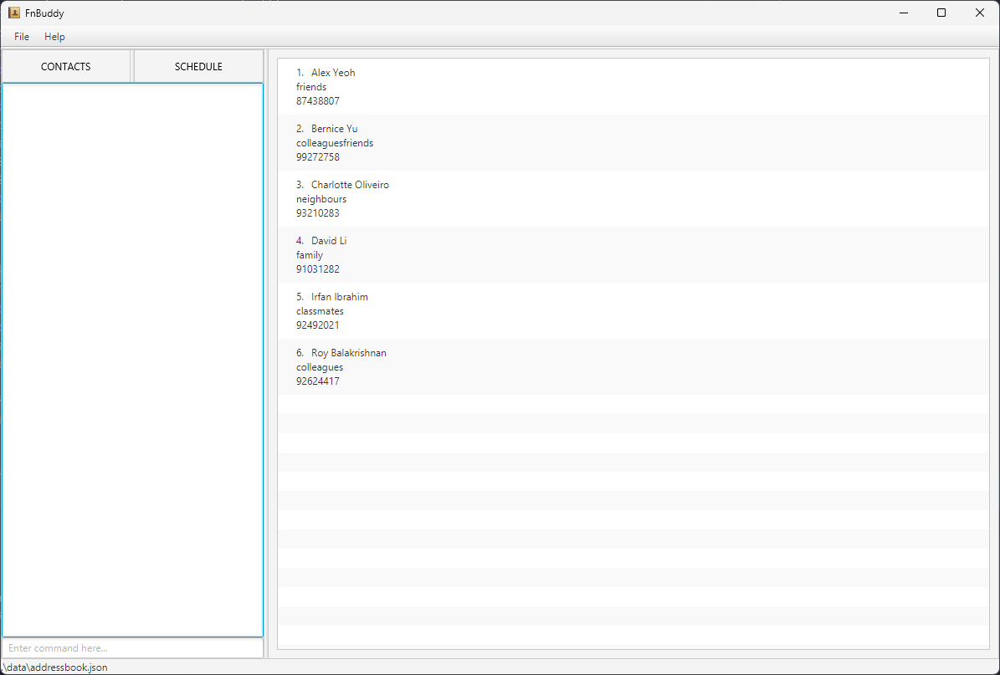

This project is based on the AddressBook-Level3 project created by the [SE-EDU initiative](https://se-education.org).

# FnBuddy
FnBuddy is an innovative employee contact management application designed specifically for restaurant managers. 
It offers a user-friendly interface (both CLI and GUI) that allows you to effortlessly create, manage, 
and maintain contact records for all your part-time employees. With FnBuddy, you can store essential information such as 
contact details, banking information, and work schedules, ensuring efficient communication and accurate payroll 
calculations.

Example usages:
  * As a restaurant manager, I can store the contact and banking details of my part-time employees for easy referral when I want to contact them or transfer their salary.
  * As a restaurant manager, I can remove the details of my part-time employees so that I can free up space in my address book.
  * As a restaurant manager, I can view the contacts of all my part-time employees so that I can have an overview of all contacts in my address book.
  * As a restaurant manager, I can use the application to store the accumulated work hours of my part-time employee for later use of salary calculation.

For the detailed documentation of this project, see the **[FnBuddy Product Website](https://ay2324s2-cs2103t-t17-4.github.io/tp/)**.
